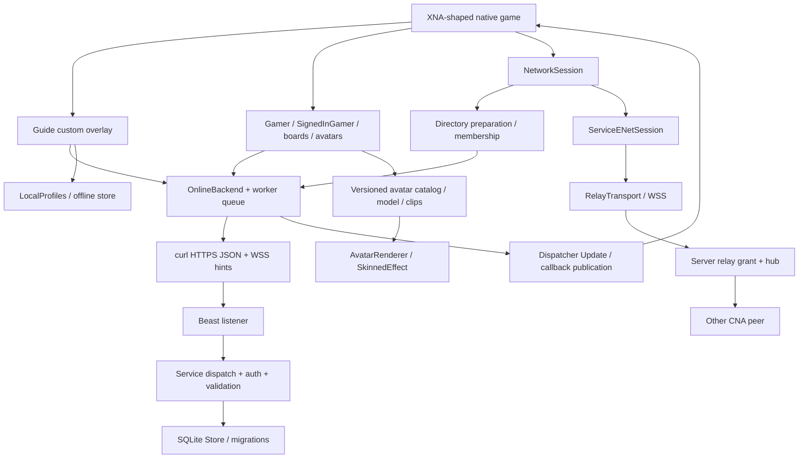
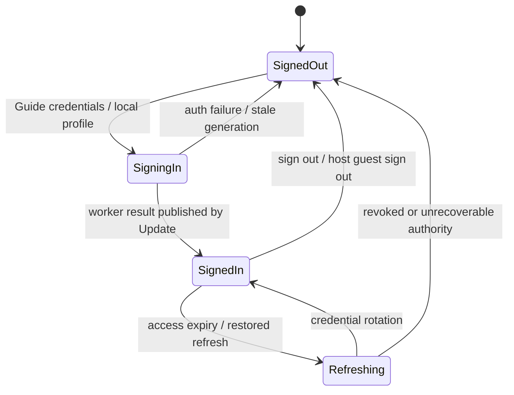

# Discovered GamerServices architecture

**Phase 3 current overlay:** native production end `2f95d29d71`, server `f627536ff6`; [handoff](gamer-services-handoff-phase3.md). The Phase 3 section below supersedes older snapshot limitations.

Historical snapshot: CNA `9976f4909`, server `e45049abc`. `server/` below means `../cna-gamer-services-server`. This maps executable/source relationships, not an intended architecture from a README. The [tracked inventory](evidence/inventory.txt) lists 1,043 discovered files; it is not a claim that every file was fully reviewed.

## Repository archaeology / requested inventory

| Category | Actual location and connection | Inspection depth |
|---|---|---|
| 1 GamerServices | `modules/gamer-services/{include,src,tests,examples,assets}`; target `CNA_GamerServices` | Main API/backend/Guide/avatar/storage paths traced; full existing unit suite executed |
| 2 Net | `modules/net/{include,src,tests,examples}`; `CNA_Net` links GamerServices and ENet | Session/identity/relay/voice paths, tests, paired harness |
| 3 Avatars | GamerServices Xna Avatar*.cpp; Internal/Avatars; assets/avatars/v1,v2,v3 | Codec, model/clip/catalog/editor/render path; headless and server tests |
| 4 Guide/system UI | GamerServices Internal/Guide*, Xna/Guide.cpp; runtime Game/input/graphics/audio | Custom overlay/state/async/social routing, unit tests |
| 5 Native/C API | `modules/c-api/include/CNA/C/{gamer_services,net_gamers}.h` and other family headers; `CnaCApiGamers`, GamerProperties, Guide, Avatars, NetGamers, GamerServices sources | Facade/handle bridge located and sampled; C pure smoke tests inventoried, not executed |
| 6 Existing bindings | `../cna-cs/src/CNA.Interop/Native.GamerServices.cs`, `CNA.XnaCompat/.../GamerServices`, Net; tests and ABI/API profiles | Read representative integration tests and refusal paths; not built or certified; no binding plan/change |
| 7 Server | `src/{Main,Listener,Service,Store,Authentication,SessionDirectory,Invitations,Parties,Privacy,Leaderboards,Avatars,AvatarAssets,Relay*,EventListener,Admin}.cpp` | All families inventoried, central handlers/security/storage traced, fresh build/tests |
| 8 Protocol | Server `protocol/include/CnaService`, v1/relay-v1 docs and golden JSON; CNA private copied headers, ServiceProtocol.cpp, Net RelayProtocol.cpp | Cross-check + paired transport tests |
| 9 Serialization | Bounded nlohmann JSON control; binary relay frames; NetPacketCodec/NetDiscoveryProtocol; avatar codec; local CNA JSON | Type/framing/validation boundaries traced |
| 10 Storage | Server Store/SQLite; LocalGamerServicesStore; LocalProfiles; CredentialStore; AssetDiskCache; AvatarCatalogStore; `modules/storage/src` | Service vs local persistence distinguished; local bug probe |
| 11 Migrations | Server `migrations/001_initial.sql` through `023_friend_voice.sql` | All applied sequentially to empty SQLite; final schema retained |
| 12 Unit tests | module-owned GamerServices/Net tests; server `tests/*Tests.cpp` | 1,150 client unit cases executed; server cases fresh Debug |
| 13 Integration | Server Python TLS/relay/cna_* e2e; CNA tools/net client harnesses; C API service client | Real client/server tests run with explicit harness env; skips/failures preserved |
| 14 Demos | module examples: demo_avatar, avatar_standard_render_test, avatar_review, avatar_editor, guide_review; net examples | Inventoried, not visually rerun |
| 15 Samples | `../cna-samples-gamer-services`, `../cna-samples`, `../cna-examples` | Repository/file discovery and selected source; repository names do not prove acceptance. Historical `/rv/tmp/samples` claims not rerun |
| 16 Tools | `tools/net`, `tools/avatar_builder/generate_avatar_catalog.py`, `tools/avatar_asset_pipeline/convert_avatar.py`; server Admin | Harness source/CLI traced; no provisioning of live data |
| 17 Plans/TODO | plan_net; plan_gamer_services_server, xbox_fidelity, avatar_polish, final_hardening; acceptance/final registers | Limitations/claims cross-checked selectively; historical labels preserved |
| 18 Generated | Server `src/*Migration.hpp.in` → build/generated headers from SQL; embedded catalog .cpp from assets; generated asset files; C API/binding profiles | Build wiring inspected, schema execution checked; generator reproducibility test not separately run |
| 19 Disabled/fake | Explicit FakeBackend and ServiceSessionDirectoryFake for tests; browser no TLS; optional Opus; conditional integration SKIP_RETURN_CODE 77 | Default `backend()` creates OnlineBackend, not FakeBackend; empty endpoint means offline, not synthetic online success |
| 20 Flags/options | `CNA_ENABLE_NET` gates modules; C API requires Net; `CNA_ENABLE_VOICE=AUTO/ON/OFF`, private CNA_VOICE_OPUS; CNA_SERVICE_TLS_TRANSPORT; EMSCRIPTEN/ANDROID curl availability; renderer selection; CNA_BUILD_TESTS | CMake plus runtime config inspected; HEADLESS reused for native tests |

Relevant sibling branches and exact hashes: [repository snapshot](evidence/repositories.txt). The supplied FNA tree has no relevant GamerServices/Net source under src in this snapshot; supplemental API shape comes from `../xna4-decomp/reference/xna4/decompiled/windows/...`. `xna4-spec` was located but not exhaustively reviewed. `sharp-runtime` supplies System objects, events, async wait handles, streams, time/region and storage facilities; those implementations were not independently audited here.

## Actual control/data flows

### Concrete call chains

- **Sign-in:** GuideSignIn → backend.signIn(slot,user,password) → `auth.login` JSON → curl `/cna/v1` → Service authenticates against users + scrypt, issues access/refresh family → Slot token/identity retained → BackendEvent → Dispatcher Update → SignedInGamers publication → SignedIn event. `IsSignedInToLive` means CNA service sign-in here, not Microsoft LIVE.
- **Profile:** Gamer BeginGetProfile/GetFromGamertag → ServiceAsyncResult → backend.profile → `profile.get` → server mayView + identity aggregate → ServiceIdentity → GamerProfile; picture hash → asset cache/file download → MemoryStream. GS-AUDIT-007 is the break in consistent profile privacy enforcement.
- **Achievements:** SignedInGamer BeginAwardAchievement → backend award → `achievements.award` → provisioned definition + authenticated user's earned row → awarded/name response → Update completion/notification. Offline branch writes local JSON instead; no automatic server synchronization of all offline progress is established.
- **Boards:** NetworkSession StartGame → local game epoch/service round → writer drafts/columns → EndGame events → per-machine commits → server schema/eligibility/arbitration → leaderboard_entries → Reader reads/pages → materialized Gamer/Entry/PropertyDictionary. A writer existing outside gameplay does not imply authorized online writes.
- **Online session:** NetworkSession Create/Find/Join → OnlineSessionOperation/Preparation → ServiceSessionDirectoryClient → authenticated directory handlers → ticket → relay connection → ENet peer/welcome/roster validation → pending observations → End consumes ready session. Public collection/events follow successful network preparation, not just an HTTP success.
- **Invitation:** Guide invite pane → `invites.send` → persistent invitation + push hint → recipient Update polls/reloads inbox → Guide consent → `invites.accept` → accepted record/InviteAccepted event → NetworkSession.JoinInvited → `sessions.joinInvited` → membership/used invitation → relay preparation. `invites.joinFriend` is the separate join-friend permission path.
- **Avatar:** Description BeginGetFromGamer → backend `avatars.get` → SQLite avatars/catalog policy → validated description+revision → exact catalog resolution (embedded or hashed downloaded pack) → AvatarRenderer async model readiness → vertex/index/texture resources and Draw. Editor → local profile write or `avatars.set` with revision → periodic description check → Changed.
- **Voice:** recording provider → one selected local talker → resample 16 kHz/20 ms frames → Opus → session packet path → peer decode/concealment → DynamicSoundEffectInstance. Server transports opaque game/voice payloads; it is not a voice mixing/transcoding service. Friend HasVoice comes from heartbeat metadata.

## Protocol compatibility

[Every declared control operation and native literal call sites](evidence/protocol-operations.md) are indexed separately. There are dynamic operation names: `friends.` + add/remove/accept (`GamerServicesBackend.cpp:302`), `parties.` + accept/decline (`:379`). Absence of a literal is not absence of a caller. `gamer.lookup` is redundant with `profile.get`; `leaderboards.definition` and `profile.setGameDefaults` have no found native call path. Operator provisioning is not the same as an end-user API call.

### Common contract, not repeated for every operation

Control requests carry `{v,id,game,op,args,token?,titleVersion?}` over POST `/cna/v1`; response has correlated id/error/result. v=1, maximum 65,536 encoded bytes, JSON depth <=16, duplicate keys and NUL/bad identifiers refused. Most operations require a title-scoped access token. Hello, login and refresh have special unauthenticated/credential rules. `hello` returns capabilities and limits; minimum title version can refuse old clients with UPDATE_REQUIRED. Snapshot parsers validate exact fields, ranges, IDs, membership and counts. This prevents silently accepting many malformed replies but means adding response fields needs coordinated compatibility handling.

Native curl verifies certificate and hostname; no redirects or ambient proxy; ordinary connect/total limits 3s/10s, file total 60s. Queued End deadline is 30s. Login/refresh expiry handling, capped heartbeat backoff, request ID replay outcomes and retained completion contexts are distinct mechanisms; not every operation can be blindly retried. Outcomes are retained about a day; successful secret-bearing replies are not replayed. Directory revision conflicts require refetch; UI errors do not become synthetic successes.

| Operation family / transport | Serialize/send → receive/handler | Validation/auth/persistence/response | Runtime evidence / remaining limits |
|---|---|---|---|
| hello, login/logout/refresh/ping | Backend exchange → Service/Authentication | v/capabilities; title; scrypt; hashed expiring tokens, rotation/revocation; sessions/families, voice heartbeat | TLS, unit, refresh and restart tests; no Microsoft credentials |
| gamer.lookup/profile.get | backend.profile sends profile.get → Service | tag lookup, mayView; aggregate profile, score, titles, picture | service/privacy/TLS; gamer.lookup alias unused by native |
| profile defaults / zone | Backend defaults read/zone UI → Service | bounded default fields, caller-owned changes; users/defaults storage | defaults unit/service; setGameDefaults native caller absent |
| friends.list/add/remove/accept | Backend friends/changeFriend → Service | authenticated mutual friendship, communication/block policy, limits; friends rows | social/privacy tests; fake-only UI tests do not prove transport |
| presence.set/status | Dispatcher dirty state / backend → Service | mode/text/status validation; per-user/title presence and last_seen | service tests; online status lease-based, not instant |
| achievements.list/award | SignedInGamer → backend → Service | title definition, authenticated user, idempotent earning; earned ticks | real TLS persistence; client-authoritative earning |
| leaderboards.read/list/definition | Reader/UI → Backend → Service/Leaderboards | board key/mode/schema, page bounds, typed columns; entries/ranks | server + real-session commits; definition route unused; no Recent expiry |
| leaderboard game begin/commit/abort | NetworkSession / writer → backend → Leaderboards | authenticated participants, gameplay epoch, local/Ranked eligibility, transaction/arbitration | atomicity/arbitration + PlayerMatch/Ranked session coverage; no game truth oracle |
| sessions.create/find/get/touch/update/join/leave/remove/addMembers | Directory client → SessionDirectory | 8 nullable int32 properties; 2–31 capacity; <=4 participant credentials; ownership, kind, state, revisions, leases | real directory; session tests partially fail at unreliable gate; NAT/add/crash unverified |
| invites.* / sessions.joinInvited | Guide/ServiceInvitations/directory → Invitations/SessionDirectory | sender membership, receiver, privacy, TTL/status/consumption and participants | real Guide invitation test passed; cross-title launch unknown |
| parties.* | GuideParty/backend dynamic action → Parties | account membership/invitation/communication; persistent party records | service/social and Guide fake tests; no independent multi-client party UI run |
| messages.* / reviews.submit | GuideSocial/backend → Service | bounded text/recipient, limits, ownership and communication/review policy; persisted messages/reviews | service_social; review-derived reputation is CNA policy |
| privacy.block/unblock/list | GuideSocial/backend → Privacy | self/cap checks, blocks, removes friendships/pending invites, hints | service_privacy; picture routes omitted from policy |
| avatars.get/set/catalog/catalogPack | description/editor/catalog loader → Avatars | byte format/catalog/CRC, caller ownership, expected revision, format projection | real CNA avatar test; immutable hashed assets, no Xbox blobs |
| assets.read and GET /cna/v1/files/hash | Backend asset/file + disk cache → Service::execute/file | token/title, asset hash authorization, size/download quotas; assets blobs | TLS/avatar tests; GS-AUDIT-007 |
| sessions.relayTicket + WSS /cna/relay/v1 | directory/relay client → RelayAuthorization/RelayListener/Hub | membership/credential families, 60s one-use ticket, <=1h grant; revocation recheck, bounded queues | raw/owned CNA relay/WSS pass; not public NAT qualification |
| WSS /cna/v1/events | backend events thread → EventListener/EventHub | token hello/revalidation, bounded per-account channels, topic hints | transport/social tests; hints prompt fetch, not durable event replay |
| ENet payload / LAN discovery | NetPacketCodec, ServiceRoster, GamePacketPolicy, NetDiscoveryProtocol | protocol/version/size/roster checks, sender/destination binding, session byte IDs | 523 Net cases incl mutation tests; Internet hostile traffic not qualified |

Relay framing is binary and versioned separately from JSON: opaque 16-byte machine destination becomes authenticated source on receive; bounded datagram size/queue/message/byte rate; endpoints do not trust a sender-selected source ID. RelayWebSocket handles fragments/control frames and the server checks authority again after attach. No STUN/ICE/TURN-style direct NAT traversal implementation was found in this path. Online traffic uses WSS/TCP, with head-of-line latency implications for ENet unreliable traffic. LAN discovery is a different UDP/ENet path.

## State machines: intended vs actual

| Flow | Public/XNA intent | Actual client | Actual server | Assessment |
|---|---|---|---|---|
| Local sign-in | up to four slots, sign events | configured/local profiles, guests; Update publishes | none | real; not fabricated default online users |
| Online sign-in | identity and privileges before online play | auth worker, generation check, token storage, Update events | title/token/family/expiry/user | working CNA identity; not LIVE |
| Create/join | pending operation becomes usable session or failure | owner-thread operation → directory → relay → ENet welcome; errors reset engine/preparation | atomically allocates membership/machine and lease; ticket authorizes tunnel | meaningful readiness; tested rollback/cancellation |
| Find | available sessions filtered for local players | authenticated participants / properties → snapshots | kind/slots/lobby-or-joinable-playing/properties/block/avoid filters | no TrueSkill or measured online QoS |
| StartGame | Lobby → Playing + GameStarted | host authority and service synchronization; opens board scopes | update checks host/revision; ranked arbitration round | source and paired tests |
| EndGame | Playing → Lobby + board events/GameEnded | stages/finalizes local or arbitrated writes, closes write scopes | validates commits, applies entries/agreement policy | retries/outcomes exist; packet gate limits full acceptance run |
| Join/leave | stable roster, GamerJoined/GamerLeft | session byte IDs mapped to account/machine; queued observations | credential-bound participants; capacity; lease/removal tables | actual integration, not disjoint models |
| Host leave/crash | migrate if allowed, else end | adopt directory host, retain roster IDs/reconnect ENet; HostChanged | deterministic eligible machine election and revision change; leases prune dead owners | service ranked migration passes; full client crash case skipped |
| Invite | consent → InviteAccepted → JoinInvited | polling/hints, UI acceptance, retained accepted record, public callback | pending → accepted → used, or dismissed/expired | real-client invitation passed |
| Service disconnect/reconnect | tolerate temporary outage or end | fresh relay authority and directory refresh within recovery window; bounded retries | durable rows persist; sockets/hubs lost; leases remain time-limited | CNA restart test passed |
| Shutdown/dispose | resources close, notifications stop | stop/join workers; session close/rollback; graphics resources released | release grants, later prune leases; one DB owner lock | source/tests; gamer object retention exception noted |

Confirmed boundary failures: online guest transition is impossible on current authenticated path; browser endpoint configuration refuses; a non-CNA avatar can pass public IsValid but cannot enter renderer Ready. No general dead state in native authentication/session creation was established. Cross-thread API misuse, long outage beyond leases, maximum roster churn and all simultaneous migration/arbitration races are not certified by the tested subset.

## Persistence inventory

[Full assembled SQL schema and checks](evidence/schema-check.txt). Server migrations are compiled from SQL at configure time; each migration sets user_version, current 23, newer databases refused. The code uses prepared SQLite statements, foreign keys, WAL, bounded busy waiting and transactions/savepoints. Service mutation/outcome serialization uses a service mutex; login scrypt temporarily releases it. Request and sign-in worker pools are separate; relay/event I/O is asynchronous.

| Data | Store and lifetime | Read/write chain / qualification |
|---|---|---|
| Users/identities | users, password salt/verifier, policy/profile columns | Admin provisioning → login/profile/privacy; persistent |
| Access/refresh | sessions, refresh_families/credentials | login/rotate/revoke; hashed secrets; expiry and replay revocation |
| Profiles/defaults | users/profile defaults; some computed fields | aggregate earned/boards/presence/reviews; not all fields independently stored |
| Pictures/catalog assets | assets blobs, title_assets, users.picture | admin/content-hash lookup; account picture authorization gap |
| Avatar state | avatars bytes/revision; avatar_catalogs/items/assets | set with revision, get/projection; client caches/catalog install independent |
| Friends | directed friends rows, mutual rows mean accepted | request/accept/remove; block cleanup; persistent |
| Achievements | definitions + earned | award/list; unique account/title/key, durable ticks |
| Leaderboards | definitions/entries/games/participants + arbitration rounds/submissions | gameplay begin/commit/abort; rank computed on read; no independent skill calculation |
| Directory sessions | directory_sessions/machines/members/removals | durable lease state, not permanent lobbies; 90s refresh/expiry basis |
| Invitations | session_invitations/send limits | pending/accepted/used/dismissed with TTL; no durable cross-title launcher |
| Presence | presence + session last_seen/status/voice | persistent metadata, online truth expires; roughly 90s visibility basis |
| Matchmaking | directory queries | no separate persistent skill/search queue |
| Messages/reviews | messages, player_reviews | owner read/delete; communication checks; review-derived reputation |
| Parties | parties/members/invitations | membership and invitations persistent; live channels still volatile |
| Moderation | blocks, user privilege flags, player_reviews | privacy restrictions/admin revocation; no complete moderation workflow demonstrated |
| Voice metadata | sessions.voice | heartbeat capability report; audio not stored; mutes/client routes independent |
| Request replay | request_ids + owner/op/outcome/result | mutation and outcome same transaction; finite retention, secret exclusions |
| Relay authority | tickets/member family references in DB | redeem/revalidate; live grants/connections/routing in process memory |
| Push | event hub in memory | notification hints only; client polling/refetch handles missed hints |
| Quotas/cache | several maps in memory | restarts reset some request/download/admission counters; not durable billing limits |
| Local gamer progress | JSON under StorageDevice root | separate offline records; numeric/write/stream issues confirmed |
| Local profile/avatar | LocalProfiles JSON and catalog cache | offline profile/editor persistence; not the legacy progress writer implementation |
| Game saves | local StorageDevice/StorageContainer filesystem | no general server cloud save protocol found |
| Client refresh secrets | CredentialStore | DPAPI on Windows; optional libsecret Linux; private-file fallback; macOS keychain not established |

Migration execution found no fresh-schema order failure or dangling FK. That result does not prove old populated databases upgrade safely, that every row is eventually pruned, or that all relevant query plans have adequate indexes. One-process ownership intentionally precludes a cluster; adding another database backend alone would not distribute hubs/leases. Admin accesses the DB separately and uses SQLite transactions, so concurrent operator changes deserve separate qualification.

## Configuration, deployment and observability

Native service config is read from user config, title manifest and environment (`CNA_GAMER_SERVICES_ENDPOINT`, `CNA_GAME_ID`, `CNA_GAME_VERSION`, CA bundle and explicit insecure-loopback flag). Avatar update/download limits are configured separately. Client title-version comparison and capabilities are real negotiation, not Microsoft title-update installation.

Server CLI accepts database/listen/port/cert/key and insecure-loopback. Default bind is loopback. A database ownership lock prevents two server instances owning the same file. Admin is a local executable; possession of OS/database access is its authorization boundary. No general remote admin HTTP API was found. Periodic log counters report outcomes, refused/open connections and relay/event counts without bodies/tokens. There is no independently qualified production deployment, backup/restore, certificate rotation, tracing or distributed operations story in this audit; the repository contains a runnable service and smoke benchmark, not evidence of those production properties.

## Phase 2: qualified paths and remaining breaks

Snapshot delta: native `33e08899f` / `38287637d`; server `f8c1491` / `d8e4fea` / `477fe69`. Phase 1 inventory above is unchanged. Exact runtime commands and provenance are in [Phase 2 handoff](gamer-services-handoff-phase2.md).

### Request, transaction and completion boundaries

```mermaid
flowchart LR
  API[Public API / Guide] --> Slot[Account slot + generation]
  Slot --> Q[Backend worker / request ID]
  Q --> JSON[Integer-preserving JSON v1]
  JSON --> TLS[TLS HTTP or WSS]
  TLS --> Auth[Token to user + title]
  Auth --> Tx[Service mutex + SQLite transaction]
  Tx --> Policy[Operation policy / mutation]
  Policy --> Commit[Commit mutation + recorded outcome]
  Commit --> Reply[Bounded response / error]
  Reply --> Pump[Completion pump / Update]
  Pump --> Observable[State + callback / End result]
```

`Service::handle` serializes shared Store access. Dispatch wraps request-id accounting and mutations together; `transaction.commit()` precedes response publication. `DurableScope` requests synchronous FULL for durable operations; leases, directory reads/mutations and repeated heartbeats use NORMAL. Not every request is recorded, and secret-bearing results are not replayed. Authentication can release the mutex for expensive password verification; do not infer one universal lock around all CPU work. Main's database ownership lock excludes a second production server.

| Operation chain | Actual handlers / state publication | Phase 2 evidence and exact boundary |
|---|---|---|
| Guide sign-in → backend authenticate → auth.login/refresh → credentials/identity | Authentication.cpp; user/title-scoped tokens → slot generation → Dispatcher.Update SignedIn | fresh public session harness signs in four accounts; restart succeeds. No Xbox identities or online guest credentials |
| Gamer.GetProfile → backend profile → profile.get | Service.cpp mayView → users/earned/board aggregates → GamerProfile | existing service privacy tests pass; viewer privileges and either block direction apply. No generic profile.update endpoint: game-default/zone setters and admin profile edits are distinct |
| GamerProfile.GetGamerPicture → asset(hash) → assets.read; catalog binary fetch → /files | Service.cpp + new Privacy.cpp mayReadAsset → content row → bytes; native hashes/verifies chunk lengths | new actual Service/SQLite tests deny both routes consistently; cached bytes avoid a new server query; HTTP 403 mapping inspected but new denial test directly calls Service::file |
| Guide friends/block → friends.add/accept/remove, privacy.block/unblock/list | server resolves target tag; authenticated user supplies owning relation → transactional rows → hints/refetch | pending vs reciprocal friend policy, both block directions tested; target IDs are not accepted as caller identity |
| SignedInGamer.AwardAchievement → achievements.award/list | key catalog check + INSERT OR IGNORE owner/title/key/ticks → awarded result → notification/completion | eight simultaneous awards/restart pass; supplied userId ignored; gameplay truth trusted |
| LeaderboardWriter session scope → game.begin/commit/abort → read | schema/epoch/membership/arbitration → SQLite ratings/typed JSON columns → native reader | public paired sessions commit/read normal scores; new storage/restart/response tests exact extrema; **not** all extreme values through public client write APIs |
| NetworkSession.Create/Find/Join/Leave | ServiceLocalGamers → participant tokens → sessions.* → directory roster/revision → relay/ENet preparation → public completion/events | fresh client/server ordinary, invite, restart, graceful migration pass; extra loopback crash/add pass. Admission failures covered by DirectoryTests; simultaneous join-full race not newly reproduced |
| Guide invite → invites.send/list/accept → JoinInvited | owner/recipient/title/session/expiry → consumed invitation → joined membership | actual CNA invite test passes; NAT variant skipped; cross-title Xbox launch semantics unknown |
| GamerPresence → presence.set/status + auth.ping | account/title rows + last_seen → friends visibility / hints | ServiceTests and privacy tests exercise service rules; no separate new public presence end-to-end probe |
| session packets / voice → relay ticket → WSS/ENet | participant tickets, machine/roster authority, channel checks → relay hub → native decode | actual relay/session tests pass; synthetic-device voice tests pass. Physical voice + Internet NAT not certified |
| AvatarDescription/Guide editor → avatars.get/set/catalog → bytes | server validates CNA codec/catalog + own account → avatar row/revision → native decode/render state | fresh paired avatar integration passes; no Xbox asset/description format interoperability |

### Version and schema qualification

`check_service_protocol.py` compares **six** source/header/golden-vector files (control and relay), not merely op names: PASS. Fresh protocol harness: **5,068 checks**. Control requests carry `v=1`; mismatches are refused. `hello` negotiates required identity/authentication/achievements capabilities; optional features have capability gates. `titleVersion` separately enforces a configured minimum game version. This is real version detection, not a claim of absent negotiation. It is not automatic schema migration or proof of interoperability with every historical client advertising version 1.

Known fields: session properties are exactly eight nullable int32 values; account/machine/session IDs are strings; NetworkGamer ID is a session byte ordinal. JSON parse bounds include 64 KiB message size, depth 16 and 256 fields/array items, duplicate key/UTF-8 refusal. Leaderboard integral columns are checked for signed width before conversion. Floats for geometry, animation fractions and measured throughput are intentional; they are not identity/tick encodings. Avatar descriptors and relay frames have their own validated binary encodings. Local offline JSON type tag `dateTime` differs from wire `datetime` intentionally in separate serializers, not a wire mismatch.

The unsigned asset-offset suspicion was disproved at the current JSON comparison guard; explicit errors are retained in evidence. Three Phase 1 server-only operations still have no literal native caller. All endpoint-field branches, all historical version combinations, and limits under adversarial concurrency remain beyond these tests.

### Persistent entities: CRUD and qualification depth

| Entity | Actual create/read/update/delete behavior | Restart / concurrency / failure evidence |
|---|---|---|
| Accounts / identities / metadata | operator Store/Admin provisions; login/read; operator policies/profile/password and limited game-default/zone setters; no general self-service delete/reset API | SQLite; existing service/token restart tests. No concurrent admin-write campaign |
| Profiles / pictures | users fields, picture hash references assets; admin imports/sets; profile.get/file/assets.read; picture replaced via admin | fresh picture test provisions then opens Service; no HTTP picture-upload endpoint; policy tests cover both data routes |
| Friends / blocks | reciprocal/pending friendship rows; insert/accept/remove; block/unblock/list | transaction + constraints, existing privacy/service tests; new picture test traverses changes. Exhaustive conflicting add/remove races not tested |
| Achievements | admin catalog; token-scoped insert/read; repeated award idempotent; no player revoke operation | new eight-thread no-lost-update test and restart; existing crash/retry tests; gameplay truth unvalidated |
| Leaderboard entries | provisioned definitions; eligible commits/seed; reads/paging; best/latest update; epoch abort separate from entry deletion | fresh paired commits; new exact integer restart/JSON test; existing arbitration tests. No old populated migration corpus |
| Avatars | own-account set/read/clear and operator provisioning; catalog/assets imports | real paired avatar/restart tests, server validation; no concurrent editor conflict/merge guarantee |
| Invitations | send/list/get/accept/dismiss; expiry/consumption/cleanup | existing real invite and service tests; recipient scope is enforced; no durable push replay guarantee |
| Directory sessions / membership | create/find/join/add/update/leave; expiry, removal and migration | real restart/migration and loopback crash/add; leases remain ephemeral despite SQLite rows; NAT skips remain |
| Presence / voice metadata | repeated account heartbeat/status writes; visible while authenticated and fresh; expiry cleanup | soft state, not voice recordings. Relay queues/event subscribers and device state live only in memory |
| Offline achievements / boards | whole-file read/modify/replace; tests reset only | write errors and exact integer data fixed; fixed temp name, no interprocess lock/fsync, corrupt-read-as-empty remain. Stream omission/column-only durability unchanged |

No database migrations changed. The new concurrency test uses the supported single Service instance, not several independent service processes. It cannot be extrapolated to clustered deployment.

## Phase 3 concurrency, authority and lifetime overlay

### Offline write boundaries

`LocalGamerServicesStore` achievement and board saves now acquire a stable sibling lock **before reading**. The lock covers read → modify → serialize → checked temp write/flush/close → rename → return. `LocalProfiles` uses the same helper around its existing read/update/replace path, including avatar/profile/default metadata. Avatar pack installation holds its version lock before fetching/staging/activation; failure returns existing Failed status without deleting staging. POSIX flock and Win32 LockFileEx serialize cooperating threads/processes on the relevant file; native locking does not hold a global mutex during unrelated catalog downloads. Lock files persist, preventing production unlink/recreate inode races; close/process death releases the lock.

Four tests use barriers (12 threads, four rounds) or coordinated pipes (eight processes), distinct intended updates and preseeded history. All four lost updates/collided before the fix and preserve keys/timestamps/rating/columns afterward. These are strongly reproducible scheduling races, not exact internal read-boundary hooks. The two lock-failure tests are deterministic. Readers see the old or replaced complete file on the tested local Linux filesystem. There is no production progress delete operation; reset helpers are test-only. No acknowledgement occurs before checked write completion, but no fsync or power-loss durability was added. Corrupt progress still reads as empty; corrupt profiles are preserved. Network filesystems, legacy unlocked writers, external lock deletion and Windows replace behavior are unqualified.

Other storage paths: CredentialStore holds its endpoint/title process lease, serializes backend persistence, uses unique temporary names and checked native replacement; no shared progress read-modify-write path was found there. AssetDiskCache stores immutable hash-validated bytes using unique temporary prefixes and backend cache serialization; concurrent eviction is opportunistic, not a hard global disk quota. Gamer state/presence is server soft state or existing profile/progress metadata, not another offline shared progression file.

### Progress trust map

| Operation/family | Classification | Actual boundary |
|---|---|---|
| achievements.award | SERVER VALIDATED BUT CLIENT AUTHORED | token owner's configured title/key, idempotent insert; no gameplay proof or client timestamp/progress mutation |
| leaderboard game commits/ranked reports | SERVER VALIDATED BUT CLIENT AUTHORED | owner/session/epoch/participants, definition/types/ranges/replay; full signed int64 legal; ranked reports require agreement, not truth |
| Earned timestamps, stored-score ranks/profile achievement totals | SERVER VERIFIED relative to stored claims | server clock, sort and aggregates; not independent proof of earning |
| Operator title definitions/catalog/reward metadata | SERVER VERIFIED within operator boundary | provisioned admin/store data; player has no definition mutation route |
| profile.setGameDefaults/profile.setGamerZone | SERVER VALIDATED BUT CLIENT AUTHORED | own-account preferences/enums; not economic rewards |
| reviews.submit | SERVER VALIDATED BUT CLIENT AUTHORED | authenticated bounded review of another player; reputation aggregate is derived |
| avatars.set | SERVER VALIDATED BUT CLIENT AUTHORED | own layout/catalog IDs/CRC/revision; catalog is public, no ownership/unlock entitlement model |
| Incremental achievement progress, challenge/reward unlock, session-result/skill/rating mutation | UNSUPPORTED (not UNKNOWN or CLIENT TRUSTED) | no such dispatch endpoint; WriteTrueSkill is an event, not a skill solver |

Extra foreign user IDs and claimed completion ticks are ignored by the supported award operation. Arbitrary game scores are intended title inputs, so INT64_MIN/MAX and negative values are not evidence of cheating by themselves. Malformed numerics, overflows, duplicate/mixed invalid batches, stale epochs and changed-payload replays are rejected without partial writes. No implemented inspected progression family remained UNKNOWN. The accepted model requires a trusted title/client or an external title-specific authority; an untrusted competitive client can still submit plausible false outcomes.

### Current authorization before data

Fresh server reads execute current token and policy checks under Service serialization/DB transactions. Read request IDs do not reuse prior recorded authorization. ProfileViewing is the **requester's privilege**, not an owner's public/private setting. Friends/block changes, current presence and logout are exercised through real TLS. Avatar descriptions/catalog grants are intentionally available to signed-in title clients; shared asset hashes may have public or multiple-owner grants.

OnlineBackend cache hits now call `assets.read` for one byte with the current token/title/hash, validate response identity/size/offset/MIME/byte, then return cached bytes. The byte cache may be shared, but an account-specific grant cannot be shared. Denials are not cached. Token revocation invalidates the slot. HTTP token-gated files retain no-store instead of advertising a year-long immutable grant. Authorization is evaluated per request, not a promise to revoke a previously returned stream, copied GamerProfile/Friend snapshot, OS-readable cache file or in-flight delivery after a later policy change.

### Proven bounds and session lifetime

| Structure | Creator / lifetime / bound | Phase 3 evidence |
|---|---|---|
| Admission rate map | socket-derived peer, preauth; one-minute buckets; 4,096 live entries | fixed insertion order/cap; no allocation for refused global256/per-peer32; exact expiry, reconnect, rate600/min and concurrent insertion checks |
| RelayHub | authenticated session grants; weak channels and detach/prune; 1,024 channels | existing authorization/flow tests; bounded64-frame queues, 1 MB/s and512 messages/s |
| EventHub | authenticated subscribers; disconnect cleanup; 4,096 total /8 per account | existing event/transport tests; not durable replay |
| Relay tickets | authenticated machine/session; one-use60 seconds, grant up to1 hour; 8 per machine/8,192 per title | retained grant invalid after session deletion; repeated release safe |
| Session/membership | authenticated account/title; 1,024 sessions/title,16 hosted/account,31 participants,4/machine,90-second lease | final-slot race exactly one wins; snapshot/delete serial outcomes; dead reconnect/leave refused |
| Invitations | authenticated title participants; 64 incoming/account/title,32/hour sender,16,384/title,900-second expiry | session foreign-key cascade; dead-session invite refused |
| Auth families/rotation/login | authenticated provisioning, token expiry;32 families/account,1,024 rotations; login history4,096 | existing auth/replay tests; no NAT/pending-auth map found |
| download/request budget maps | provisioned authenticated accounts/titles; opportunistic stale pruning | no reproduced preauth unlimited growth here; authenticated cardinality/load remains DEFERRED |

Service mutex plus SQLite transactions define serial outcomes within the supported single server process; independent competing servers on one database are prohibited. Added last-slot and session destruction tests verify roster/dependent tickets/invites/participants, retained relay authority and repeated release. They do not certify every social/admin/churn race. [Network status, timeouts and manual device qualification](evidence/phase3/manual-qualification.md).

Existing voice consumers still use a signed-in gamer privilege snapshot and initial/local Guide block state. Backend renewal refreshes private identity state without updating already published privileges; a cross-device policy change is not qualified for ongoing voice. This source-qualified MEDIUM boundary requires a focused synthetic-voice/controller test, not a claim that fresh server profile authorization remains broken.
