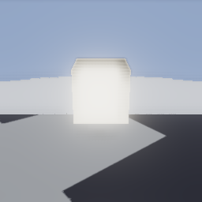
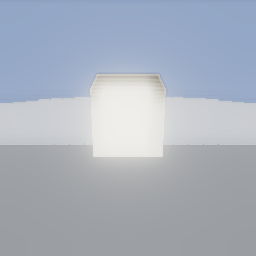
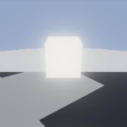
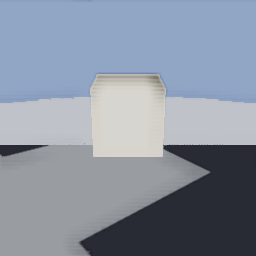
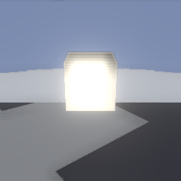
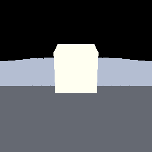

# The engine layer, all of it, in one frame

`plans/plan_modern.md` **MOD-1808** / **MOD-1811**. Every other example in `modules/graphics-ext/examples/`
isolates one subsystem so a failure names itself. This one does the opposite, because "each
subsystem works" and "they work together" are different claims and a game only cares about the
second.

```bash
cmake -S . -B cmake-build-cnaext -G Ninja -DCNA_CNAEXT=ON -DCNA_GRAPHICS_RENDERER=OPENGLES3
cmake --build cmake-build-cnaext --target cna_test_cnaext_showcase

# From the repository root, with a display.
DISPLAY=:99 SDL_VIDEODRIVER=x11 ./cmake-build-cnaext/cna_test_cnaext_showcase

# The same run, writing the images below.
DISPLAY=:99 SDL_VIDEODRIVER=x11 ./cmake-build-cnaext/cna_test_cnaext_showcase \
    --screenshots docs/images/cnaext
```

It also runs as the `CNAEXT_Showcase` ctest. Exit code 0 = every check passed, 1 = one failed,
77 = the renderer cannot do all of it and the program says which part it lacks.

## The scene

A ground plane, one emissive PBR box lit by an image-based light, 576 instanced cubes behind it
under frustum culling and LOD, a sky, and a sun. The frame goes through the whole pipeline: a
depth/normal prepass, SSAO, an HDR scene target, bloom, ACES tonemapping and FXAA.



## How it is checked

Not by comparing this image to a stored one. Every check is an **A/B against the same frame with
exactly one subsystem switched off**, which is the failure a per-subsystem test cannot see: a pass
that quietly stops contributing once another one runs ahead of it.

| Subsystem off | What changes | Image |
|---|---|---|
| Shadows | ~3 300 of 65 536 pixels stop being darker; the diagonal under the box disappears |  |
| SSAO | the strong occlusion term at the contacts goes |  |
| Bloom | light stops spreading beyond the box's silhouette |  |
| Tonemapping | the highlights clip instead of rolling off |  |
| Everything | pixel-for-pixel identical to not using a pipeline at all |  |

Two of those checks are scored more carefully than they look, and both for the same reason — a
threshold that is too generous passes for the wrong reason:

- **The shadow** is counted over the whole frame rather than sampled in a fixed window. Where a
  shadow lands depends on the sun angle and the camera; a window guessed from one run is how an A/B
  ends up measuring lit ground and reporting no difference. The count also has an *upper* bound:
  more than a third of the frame darkening would mean a global exposure change, not a shadow.
- **SSAO** is scored on pixels darkened by **8 levels or more**, not by 2. At the weak margin the
  count is 14 140 of 16 384 — a hemisphere AO at this radius puts a slight term almost everywhere,
  and a check that accepted that would pass just as happily if the pass had become a global dimmer.
  What says "occlusion" is that a small, bounded part of the frame darkens a lot.

## What the run reports

```
passes 4, target switches 6, scene target yes, sky yes, 393216 bytes, 394 instances drawn
```

The statistics are part of the test, not decoration: with everything enabled the pipeline must
report that the passes ran, the scene went through an off-screen target, the sky drew and the
shadow pass ran. A subsystem that silently did nothing shows up here before it shows up in a pixel.

## Two things the example is careful about, which a caller has to be too

- **The prepass is the caller's job.** SSAO reads a depth and a normal texture that
  `DepthNormalPrepass` writes, and running it — and only running it when SSAO is on — is the one
  ordering in the layer the caller owns rather than the pipeline.
- **Shadows have a receiving half.** Switching `setShadowsEnabled(false)` stops the pass running;
  it does not stop a lit effect sampling a map that now holds nothing. The example carries that as
  a named flag rather than a call buried in the render path, because forgetting it is the obvious
  mistake.
